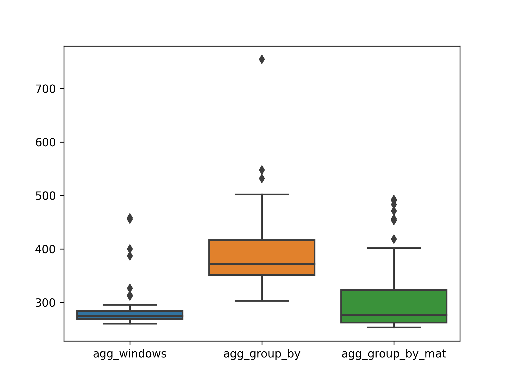
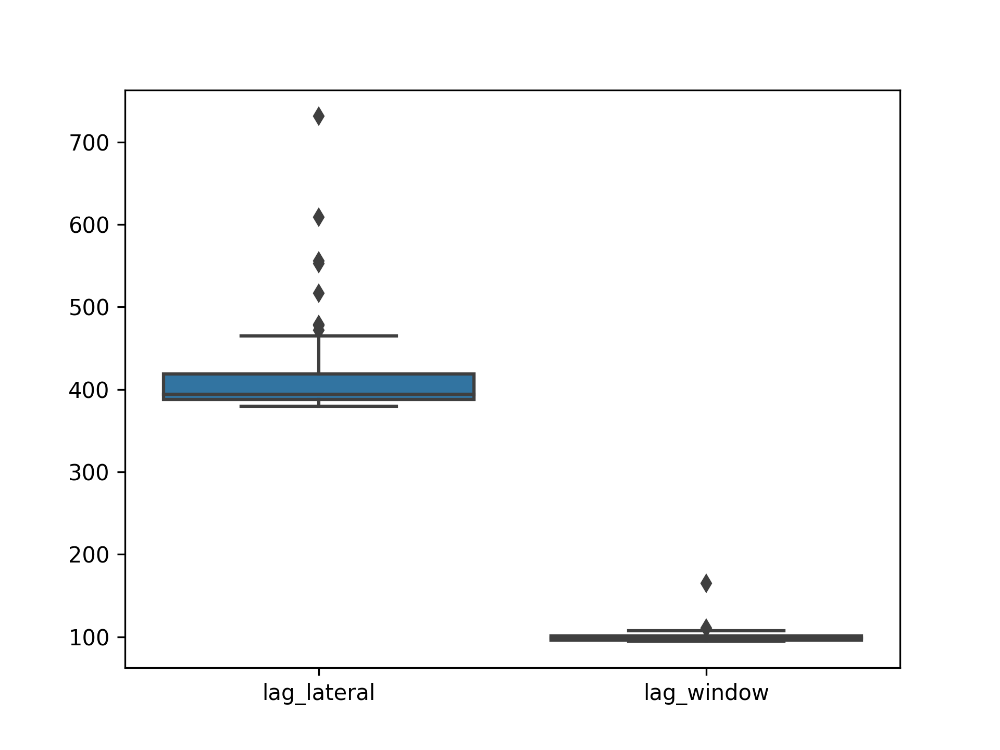
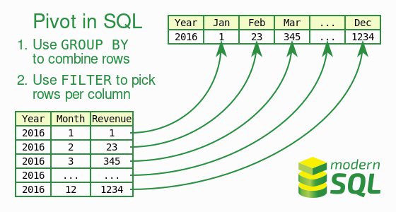

# Café développeur·se LIRIS : SQL moderne

Support de présentation pour le [café développeur·se LIRIS : SQL moderne](https://projet.liris.cnrs.fr/edp/cafes-developpeur-liris/2023-05-11-sql-moderne.html).

- [Café développeur·se LIRIS : SQL moderne](#café-développeurse-liris--sql-moderne)
  - [Introduction](#introduction)
    - [Jeux de données](#jeux-de-données)
    - [Documentation PostgreSQL de référence](#documentation-postgresql-de-référence)
  - [Dates, heures et intervalles](#dates-heures-et-intervalles)
  - [Gestion des modifications](#gestion-des-modifications)
    - [Auto-increment avec `AS IDENTITY`](#auto-increment-avec-as-identity)
    - [`RETURNING`](#returning)
    - [`UPDATE` or `INSERT`](#update-or-insert)
  - [Fonctions de fenêtrage (_windows function_)](#fonctions-de-fenêtrage-windows-function)
    - [Solution traditionnelle](#solution-traditionnelle)
    - [Solution _windows_](#solution-windows)
    - [Performance des fonctions de fenêtrage](#performance-des-fonctions-de-fenêtrage)
    - [Clauses `ORDER BY` et `RANGE/ROWS/GROUP` des fenêtres](#clauses-order-by-et-rangerowsgroup-des-fenêtres)
  - [Requêtes analytiques](#requêtes-analytiques)
    - [Codage du pivot](#codage-du-pivot)
    - [Les opérateurs de regroupement `GROUPING SETS`](#les-opérateurs-de-regroupement-grouping-sets)
  - [Vues, vues récursives et vues matérialisées](#vues-vues-récursives-et-vues-matérialisées)
    - [Les _Common Table Expression_ (CTE)](#les-common-table-expression-cte)
    - [Exercices](#exercices)

## Introduction

_A lot has changed since SQL-92_ _dixit_ Markus WINAND sur <https://modern-sql.com/>. Toutefois, dans les formations universitaires comme dans la pratique, de nombreux utilisateurs connaissent mal les constructions introduites après 1992.

Le but de ce café est de montrer des opérateurs SQL des [standards contemporains](https://en.wikipedia.org/wiki/SQL#Standardization_history) (SQL:1999, SQL:2003, SQL:2011).
Que ce soit pour leur pouvoir d'expression, pour leur facilité d'utilisation ou pour leurs performances, ces opérateurs facilitent grandement certaines activités. Seront notamment abordés :

- la extractions de dates avec `EXTRACT`,
- le contrôle des écritures `RETURNING`, `ON CONFLICT` et `MERGE`,
- les opérateurs pour les requêtes analytiques `WINDOWS`, `GROUPING` et `FILTER`,
- les `Common Table Expression` avec `WITH` (et `WITH RECURSIVE`).

On s'appuiera sur PostgreSQL version 15 pour les exemples.
On restera _au plus proche du standard SQL_, en remarquant tant que possible ce qui est spécifique à PostgreSQL.

### Jeux de données

Pour la mise en place, créer un utilisateur et une base `cafe` :

```bash
# impersoner le compte privilégié PostgreSQL
sudo -i -u postgres
# créer l'utilisateur
createuser --createdb --pwprompt cafe
# créer la base
createdb --owner cafe cafe
exit
# vérifier le login/password
psql -U cafe -h localhost -p 5433
```

Les fichiers suivants, à exécuter avec l'utilisateur `cafe` dans la base `cafe`, permettent de créer les relations suivantes :

- [db_demo.sql](data/db_demo.sql) : des relations temporaires d'exemple,
- [db_emp_dep.sql](data/db_emp_dep.sql) : un jeu d'essai _RH_ avec une table `emp` pour les employés et une table `dep` pour la hiérarchie des services :
  - [generate_emp.sql](data/generate_emp.sql) : génère 100.000 employés mais ne génère **pas** de services,
  - [generate_emp_dep.sql](data/generate_emp_dep.sql) : génère 100.000 employés **et** 1000 services (sans hiérarchie).
- [db_sensor.sql](data/db_sensor.sql) : une table `sensor` contenant des données générées aléatoirement.

Un programme Python de comparaison de performance de requêtes [bench.py](bencher/bench.py) est fourni avec [requirements.txt](bencher/requirements.txt).

### Documentation PostgreSQL de référence

- `RETURNING`
  - <https://www.postgresql.org/docs/current/dml-returning.html>
  - <https://www.postgresql.org/docs/current/sql-insert.html>
- `ON CONFLICT` pour les _UPSERTS_
  - <https://www.postgresql.org/docs/current/sql-insert.html#SQL-ON-CONFLICT>
- `MERGE` pour les _UPSERTS_
  - <https://www.postgresql.org/docs/current/sql-merge.html>
- `timestamp`, `EXTRACT` et `to_char`
  - <https://www.postgresql.org/docs/current/datatype-datetime.html>
  - <https://www.postgresql.org/docs/current/functions-datetime.html#FUNCTIONS-DATETIME-EXTRACT>
  - <https://www.postgresql.org/docs/current/functions-formatting.html>
- _windows function_
  - <https://www.postgresql.org/docs/current/tutorial-window.html>
  - <https://www.postgresql.org/docs/current/sql-expressions.html#SYNTAX-WINDOW-FUNCTIONS>
  - <https://www.postgresql.org/docs/current/functions-window.html>
- `GENERATED [...] AS IDENTITY` à la place du type `serial` pour les auto-increments
  - <https://www.postgresql.org/docs/current/sql-createtable.html>
- `GROUPING SETS`, `CUBE`, et `ROLLUP` pour les opération _cube_
  - <https://www.postgresql.org/docs/current/queries-table-expressions.html#QUERIES-GROUPING-SETS>
- `FILTER` clause pour calculer des _pivots_
  - <https://www.postgresql.org/docs/current/sql-expressions.html#SYNTAX-AGGREGATES>
- `LATERAL JOIN` _subqueries_
  - <https://www.postgresql.org/docs/current/queries-table-expressions.html#QUERIES-LATERAL>
- `[MATERIALIZED] VIEW`
  - <https://www.postgresql.org/docs/current/tutorial-views.html>
  - <https://www.postgresql.org/docs/current/sql-createview.html>
  - <https://www.postgresql.org/docs/current/sql-creatematerializedview.html>
- `WITH [RECURSIVE]` clause, _Common Table Expression_
  - <https://www.postgresql.org/docs/current/queries-with.html>
- `FETCH { FIRST | NEXT } [ count ] { ROW | ROWS } { ONLY | WITH TIES }` l'équivalent standard de `LIMIT`
  - <https://www.postgresql.org/docs/current/sql-select.html#SQL-LIMIT>
- `LIKE, SIMILAR TO, LIKE_REGEX` et autres pour la recherche de sous-chaînes
  - <https://www.postgresql.org/docs/current/functions-matching.html>

#### Complément

- un exposé _Postgres Window Magic_ de Bruce MOMJIAN <https://momjian.us/main/presentations/sql.html> (vidéo et slides)
- <https://modern-sql.com/> _A lot has changed since SQL-92_ par Markus WINAND.

## Dates, heures et intervalles

Les dates disposent d'opérateurs SQL standardisés.
On construit l'exemple ci-dessous ([source](data/db_demo.sql)) avec au passage l'option `TEMPORARY`, une [colonne générée](https://www.postgresql.org/docs/current/ddl-generated-columns.html) et les dates à différentes précisions au format [ISO 8601](https://en.wikipedia.org/wiki/ISO_8601).
Il est recommandé d'utiliser **systématiquement** un fuseau horaire.

```sql
DROP TABLE IF EXISTS demo;

CREATE TEMPORARY TABLE demo(
  demo_id int PRIMARY KEY,
  demo_name text,
  demo_ts timestamp with time zone DEFAULT CURRENT_TIMESTAMP(0),
  epoch_utc bigint GENERATED ALWAYS AS (EXTRACT (epoch FROM demo_ts at time zone 'UTC')) STORED
);

INSERT INTO demo VALUES
  (1, 'toto', '2023-04-25'),
  (2, 'titi', '2023-04-25T16:03'),
  (3, 'tutu', '2023-04-25T16:03:45'),
  (4, 'tata', '2023-04-25T16:03:45.123'),
  (5, 'tata', '2023-04-25T16:03:45.123456'),
  (6, 'tete', '2023-04-25T16:03:45.123456+11');

-- extension PostgreSQL, raccourci pour
-- SELECT * FROM demo
TABLE demo;
```

L'opérateur [`EXTRACT(field FROM source)`](https://www.postgresql.org/docs/current/functions-datetime.html#FUNCTIONS-DATETIME-EXTRACT) permet d'extraire le numéro de jour dans la semaine, le jour de l'année, etc. des `timestamp`.
La fonction [`to_char`](https://www.postgresql.org/docs/current/functions-formatting.html) permet la conversion en chaînes de caractères.
Le type `interval` permet de gérer les différences entre deux dates et de faire des additions et soustractions avec les `timestamp`.

```sql
-- SET lc_time TO 'en_GB.utf8';

SELECT
  EXTRACT(CENTURY FROM demo_ts) AS century,
  EXTRACT(DOY FROM demo_ts) AS doy, -- day of the year
  EXTRACT(DOW FROM demo_ts) AS dow, -- day of the week
  EXTRACT(WEEK FROM demo_ts) AS week,
  EXTRACT(MINUTE FROM demo_ts) AS minute,
  to_char(demo_ts, 'TMDay DD TMMonth YYYY à HH:MM')
FROM
  demo;

SELECT
    demo_ts - (INTERVAL '1 day') AS day_before,
    demo_ts,
    demo_ts + (INTERVAL '1 week') AS week_after
FROM
    demo;

-- nb heures depuis le 25 avril
SELECT CAST(EXTRACT(epoch FROM now() - '2023-04-25')/3600 AS int) AS hours;

-- la TZ de la NC
SELECT * FROM pg_timezone_names WHERE name ~* 'noumea' AND name !~ '^posix';

-- le jour du grand crash
SELECT to_timestamp(2^31) at time zone 'Pacific/Noumea';
```

## Gestion des modifications

### Auto-increment avec `AS IDENTITY`

La définition suivante de la table `emp` de la base d'exemple définit une clef primaire avec la contrainte `GENERATED BY DEFAULT AS IDENTITY` qui est standard et qui remplace désormais le type (non standard) `serial` de PostgreSQL.

```sql
CREATE TABLE emp(
    depname text NOT NULL REFERENCES dep(depname),
    empno int GENERATED BY DEFAULT AS IDENTITY PRIMARY KEY,
    salary int NOT NULL
);
```

Il est aujourd'hui **recommandé** d'utiliser la clause `AS IDENTITY` et non plus le type `serial` qui pose un problème de gestion des droits sur la séquence associée à la colonne auto-incrémentée.

- <https://stackoverflow.com/questions/55300370/postgresql-serial-vs-identity>
- <https://www.2ndquadrant.com/en/blog/postgresql-10-identity-columns/>
- <https://wiki.postgresql.org/wiki/Don%27t_Do_This#Don.27t_use_serial>

### `RETURNING`

Extrait de la [documentation](https://www.postgresql.org/docs/current/sql-insert.html) de la clause `INSERT`.

> The optional `RETURNING` clause causes `INSERT` to compute and return value(s) based on each row actually inserted (or updated, if an `ON CONFLICT DO UPDATE` clause was used). This is _primarily useful for obtaining values that were supplied by defaults_, such as a serial sequence number. However, any expression using the table's columns is allowed.

La clause `RETURNING` est notamment utilisée sur les `WITH` avec des modifications.
La clause existe dans d'autres SGBD mais n'est pas complètement standard.

Le script suivant semblable à [generate_emp.sql](data/generate_emp.sql) génère des employés dans le département `sales` et retourne les identifiants `empno` créés.

```sql
-- /!\ attention au comportement si on mixe auto-increment et valeurs manuelles /!\
TRUNCATE emp;

WITH insert_query AS(
    INSERT INTO emp(depname, salary) (
        SELECT
            'sales' as depname,
            round(random() * 2000 + 3000) AS salary
        FROM
            generate_series(1, 10) AS g(i)
    )
    RETURNING depname, empno, salary
)

SELECT *
FROM insert_query JOIN dep USING (depname)
;
```

### `UPDATE` or `INSERT`

L'_upsert_, appelé aussi _update or insert_ est une opération qui consiste à _tenter_ d'insérer et de faire à défaut une mise-à-jour si le tuple existe déjà en **une seule** commande. Il y a deux façons de le faire en PostgreSQL.

#### Clause `ON CONFLICT`

<https://www.postgresql.org/docs/current/sql-insert.html#SQL-ON-CONFLICT>

C'est la solution traditionnelle avant la version 15, elle est presque standard. Elle permet de de spécifier le comportement en cas d'exception levée par un conflit de contrainte de clef primaire ou de contrainte d'unicité.

```sql
INSERT INTO demo VALUES (0, 'collision', DEFAULT);
-- ERROR:  23505: duplicate key value violates unique constraint "demo_pkey"

INSERT INTO demo VALUES (0, 'collision', DEFAULT)
ON CONFLICT (demo_id) DO NOTHING;
-- INSERT 0 0

INSERT INTO demo VALUES (0, 'collision', DEFAULT)
ON CONFLICT ON CONSTRAINT demo_pkey DO NOTHING;
-- INSERT 0 0

INSERT INTO demo VALUES (0, 'collision', DEFAULT)
ON CONFLICT ON CONSTRAINT demo_pkey DO UPDATE SET
  demo_name=EXCLUDED.demo_name,
  demo_ts=EXCLUDED.demo_ts;
-- INSERT 0 1
```

#### Commande `MERGE`

C'est la solution standard SQL pour les _upsert_ supportée depuis la version 15 de PostgreSQL.
Elle permet des traitements impossible avec `ON CONFLICT` mais n'intègre pas de clause `RETURNING`.

```sql
WITH vals(demo_id, demo_name, demo_ts) AS(
    VALUES
    (42, 'tyty', CURRENT_TIMESTAMP),
    (43, 'tyty', CURRENT_TIMESTAMP)
)

MERGE INTO demo USING vals ON demo.demo_id = vals.demo_id
    WHEN MATCHED THEN UPDATE SET
        demo_ts = vals.demo_ts,
        demo_name = vals.demo_name
    WHEN NOT MATCHED THEN
        INSERT VALUES (vals.*)
;
```

## Fonctions de fenêtrage (_windows function_)

> A _window function_ performs a calculation across a set of table rows that are somehow related to the current row. This is comparable to the type of calculation that can be done with an aggregate function. However, _window functions do not cause rows to become grouped into a single output row like non-window aggregate calls would_. Instead, the rows retain their separate identities. Behind the scenes, the window function is able to access more than just the current row of the query result ([source](https://www.postgresql.org/docs/current/tutorial-window.html)).

On a souvent besoin de combiner le résultat d'un agrégat avec des données _de la même table_ pour par exemple étendre une entité avec des statistiques issue des associations comme avoir toutes les informations des étudiants et le nombre de candidatures et d'inscription. Dans ces applications, on a une tension entre :

- le regroupement nécessaire au calcul, spécifié dans la clause `GROUP BY`,
- le résultat final qu'on ne veut **pas** regroupés, où on veut **toutes** les lignes.

On va prendre comme exemple la requête suivante.

**Requête :** _calculer toutes les informations de chaque employé ainsi que la différence entre son salaire et le salaire moyen de son équipe_.

### Solution traditionnelle

Sans fenêtrage, on fait une sous-requête d'agrégation **et** une jointure sur la même table, avec une requête imbriquée dans le `FROM` comme suit.

```sql
SELECT emp.*, round(salary - sal.avg) AS delta
FROM emp JOIN (
    SELECT depname, AVG(salary) as avg
    FROM emp GROUP BY depname) AS sal
    ON emp.depname = sal.depname
ORDER BY depname, empno;
```

On vérifie par exemple que le salaire moyen des développeurs est de 5020 et que le résultat est cohérent.

```raw
  depname  | empno | salary | delta
-----------+-------+--------+-------
 develop   |     7 |   4200 |  -820
 develop   |     8 |   6000 |   980
 develop   |     9 |   4500 |  -520
 develop   |    10 |   5200 |   180
 develop   |    11 |   5200 |   180
 personnel |     2 |   3900 |   200
 personnel |     5 |   3500 |  -200
 sales     |     1 |   5000 |   300
 sales     |     3 |   4800 |   100
 sales     |     4 |   4800 |   100
 sales     |    12 |   4200 |  -500
```

Une requête équivalente avec une CTE `WITH`. Solution personnellement recommandée car elle rend la sous-requête plus lisible.
Ici sur l'exemple, on a **exactement le même plan d'exécution** (et donc le même résultat), voir [agg_group_by.sql](queries/agg_group_by.sql).

```sql
WITH sal AS(
    SELECT depname, AVG(salary) as avg
    FROM emp GROUP BY depname
)

-- join emp/dep
SELECT emp.*, round(salary - sal.avg) AS delta
FROM emp JOIN sal
    ON emp.depname = sal.depname
ORDER BY depname, empno;
```

### Solution _windows_

Avec les fonctions de fenêtrage on définit _le groupement intermédiaire sur lequel faire le calcul_, ici de moyenne et les tuples concernés au sein du groupement (par défaut tous), voir [perf_agg_windows.sql](queries/agg_windows.sql)

```sql
SELECT  emp.*,
        round(salary - avg(salary) OVER (PARTITION BY depname)) AS delta
FROM emp
ORDER BY depname, empno;
```

On peut grâce aux _windows function_ faire des opérations **difficiles à exprimer** sur le `GROUP BY`, par exemple le calcul _du rang_ (dense ou pas) du salarié dans son équipe. Le calcul du rang est particulièrement désagréable en SQL-92

**Requête :** _calculer le rang dense de chaque employé (les ex aequos ne créant pas de trous) par ordre de salaire décroissant au sein de son équipe avec l'écart à la moyenne entre son salaire et celle de son équipe_

La requête s'exprime comme suit, voir [agg_rank.sql](queries/agg_rank.sql).

```sql
SELECT  emp.*,
        dense_rank() OVER (PARTITION BY depname ORDER BY salary DESC) AS rank,
        round(salary - avg(salary) OVER (PARTITION BY depname)) AS delta
FROM emp
ORDER BY depname, rank, empno;
```

```raw
  depname  | empno | salary | rank | delta
-----------+-------+--------+------+-------
 develop   |     8 |   6000 |    1 |   980
 develop   |    10 |   5200 |    2 |   180
 develop   |    11 |   5200 |    2 |   180
 develop   |     9 |   4500 |    3 |  -520
 develop   |     7 |   4200 |    4 |  -820
 personnel |     2 |   3900 |    1 |   200
 personnel |     5 |   3500 |    2 |  -200
 sales     |     1 |   5000 |    1 |   300
 sales     |     3 |   4800 |    2 |   100
 sales     |     4 |   4800 |    2 |   100
 sales     |    12 |   4200 |    3 |  -500
```

### Performance des fonctions de fenêtrage

En plus de l'expression concise (mais assez absconse) et de l'expressivité augmentée par rapport aux agrégats usuels SQL-92, les fonctions de fenêtrage sont **performantes**.
On reprend le jeu d'essai avec un peu plus de volume en générant 1 000 services et 100 000 employés, consulter et exécuter le fichier [generate_emp_dep.sql](data/generate_emp_dep.sql).

On va comparer la solution traditionnelle SQL-92 avec celle avec le fenêtrage grâce à la commande `EXPLAIN ANALYZE`.
Pour la solution traditionnelle avec `GROUP BY` et `JOIN`, on obtient le plan suivant où la jointure est très efficace (un seul tuple par `depname` dans la sous-requête).

```raw
                                           QUERY PLAN
------------------------------------------------------------------------------------------------
 Sort  (cost=14737.38..14987.38 rows=100000 width=46)
   Sort Key: emp.depname, emp.empno
   ->  Hash Join  (cost=2076.00..4630.61 rows=100000 width=46)
         Hash Cond: (emp.depname = sal.depname)
         ->  Seq Scan on emp  (cost=0.00..1541.00 rows=100000 width=14)
         ->  Hash  (cost=2063.50..2063.50 rows=1000 width=38)
               ->  Subquery Scan on sal  (cost=2041.00..2063.50 rows=1000 width=38)
                     ->  HashAggregate  (cost=2041.00..2053.50 rows=1000 width=38)
                           Group Key: emp_1.depname
                           ->  Seq Scan on emp emp_1  (cost=0.00..1541.00 rows=100000 width=10)
(10 rows)

```

Avec la fonction de fenêtrage, le plan est débarrassé de la jointure comme suit.

```raw
                                  QUERY PLAN
------------------------------------------------------------------------------
 Incremental Sort  (cost=10856.19..20164.88 rows=100000 width=46)
   Sort Key: depname, empno
   Presorted Key: depname
   ->  WindowAgg  (cost=10848.27..13348.27 rows=100000 width=46)
         ->  Sort  (cost=10848.27..11098.27 rows=100000 width=14)
               Sort Key: depname
               ->  Seq Scan on emp  (cost=0.00..1541.00 rows=100000 width=14)
```

Si on force la matérialisation de la sous-requêtes `WITH` comme dans [agg_group_by_materialized.sql](queries/agg_group_by_materialized.sql), le plan est encore différent :

```raw
                                   QUERY PLAN
--------------------------------------------------------------------------------
 Sort  (cost=17920.02..18170.02 rows=100000 width=46)
   Sort Key: emp.depname, emp.empno
   CTE sal
     ->  HashAggregate  (cost=2041.00..2053.50 rows=1000 width=38)
           Group Key: emp_1.depname
           ->  Seq Scan on emp emp_1  (cost=0.00..1541.00 rows=100000 width=10)
   ->  Hash Join  (cost=3280.00..5759.75 rows=100000 width=46)
         Hash Cond: (sal.depname = emp.depname)
         ->  CTE Scan on sal  (cost=0.00..20.00 rows=1000 width=64)
         ->  Hash  (cost=1541.00..1541.00 rows=100000 width=14)
               ->  Seq Scan on emp  (cost=0.00..1541.00 rows=100000 width=14)
```

Sur 100 exécutions, on obtient les statistiques suivantes où les fonctions de fenêtrage sont **compétitives**.

```raw
python3 bench.py --repeat 100 --verbose ../queries/agg_windows.sql ../queries/agg_group_by.sql ../queries/agg_group_by_mat.sql

INFO:PERF:Total running time 97.93 for 300 queries
Statistics for each file
../queries/agg_windows.sql      mean = 282.39 ms, stdev = 32.11 ms, median = 274.72 ms
../queries/agg_group_by.sql     mean = 390.85 ms, stdev = 63.58 ms, median = 372.51 ms
../queries/agg_group_by_mat.sql mean = 302.13 ms, stdev = 58.74 ms, median = 276.95 ms
Pairwise (Welch) T-tests
../queries/agg_windows.sql      < ../queries/agg_group_by.sql    : pvalue = 0.00% (****) (!= 0.00%)
../queries/agg_windows.sql      < ../queries/agg_group_by_mat.sql: pvalue = 0.18% (**) (!= 0.37%)
../queries/agg_group_by_mat.sql < ../queries/agg_group_by.sql    : pvalue = 0.00% (****) (!= 0.00%)
```



### Clauses `ORDER BY` et `RANGE/ROWS/GROUP` des fenêtres

La syntaxe complète des `WINDOWS` comporte [de nombreux opérateurs](https://www.postgresql.org/docs/current/sql-expressions.html#SYNTAX-WINDOW-FUNCTIONS).
On peut définir la partition avec `PARTITION BY` mais aussi l'ordre de tri au sein de la partition avec `ORDER BY` et la _largeur_ de la fenêtre au sein de la partition avec `{ RANGE | ROWS | GROUPS }`.
L'ordre est nécessaire pour certaines fonctions comme `rank()` ou `dense_rank()`

```raw
[ existing_window_name ]
[ PARTITION BY expression [, ...] ]
[ ORDER BY expression [ ASC | DESC | USING operator ] [ NULLS { FIRST | LAST } ] [, ...] ]
[ frame_clause ]
```

Au sein de la fenêtre, c'est-à-dire le sous-ensemble des tuples de la partition pris en compte pour le calcul, on peut utiliser des fonctions qui permettent de référencer les tuples précédents comme `lag()` ou suivants comme `lead()`.
Un exemple typique est celui des requêtes où l'on calcule un _sous-total courant ou un delta_ avec la ligne précédente ou la requête suivante sur la table `sensor`.

**Requête :** _pour chaque capteur, calculer le temps en seconde entre deux relevés consécutifs_

On utilise la fonction `lag()` et la soustraction de dates qui donne un intervalle temporel..
Quand la définition de la fenêtre est longue ou employée sur plusieurs attributs, on peut la définir avec la clause `WINDOWS` et la réemployer comme suit.

```sql
SELECT sensor.*,
       time_stamp - (lag(time_stamp) OVER w) AS delta
FROM sensor
WINDOW w AS (PARTITION BY sensorid ORDER BY time_stamp ASC)
ORDER BY sensorid, time_stamp;
```

Comme avec [db_sensor.sql](data/db_sensor.sql) on a généré 100 000 relevés espacés d'environ 1 seconde en tirant au hasard à chaque fois parmi 10 capteurs, on peut vérifier que l'écart moyen de deux relevés du même capteur est de 10 secondes. Voir le fichier [agg_delta_time.sql](queries/agg_delta_time.sql) qui reprend la requête précédente.

On peut aussi avoir besoin de définir la fenêtre pour fixer un intervalle sur lequel on souhaite regrouper.
La fenêtre est par défaut **tous tuples du groupe** défini par `PARTITION BY` s'il n'y a pas de `ORDER BY` et **tous les précédents** quand la fenêtre est ordonnée.

C'est assez complet et parfois subtil.
Ci-dessous [la syntaxe](https://www.postgresql.org/docs/current/sql-expressions.html#SYNTAX-WINDOW-FUNCTIONS) des `frame_clause`, `frame_start` et `frame_end`

```raw
# The optional frame_clause can be one of

{ RANGE | ROWS | GROUPS } frame_start [ frame_exclusion ]
{ RANGE | ROWS | GROUPS } BETWEEN frame_start AND frame_end [ frame_exclusion ]

# where frame_start and frame_end can be one of

UNBOUNDED PRECEDING
offset PRECEDING
CURRENT ROW
offset FOLLOWING
UNBOUNDED FOLLOWING

# and frame_exclusion can be one of

EXCLUDE CURRENT ROW
EXCLUDE GROUP
EXCLUDE TIES
EXCLUDE NO OTHERS
```

#### Exemples de contrôle des fenêtres

On souhaite calculer _sans différencier les capteurs, la somme cumulée de la valeur_. C'est typiquement l'exemple d'une colonne _sous-total courant_ dans un ticket de caisse, voir [agg_cumul_sum.sql](queries/agg_cumul_sum.sql).

```sql
SELECT time_stamp,
       value,
       sum(value) OVER (ORDER BY time_stamp ASC RANGE UNBOUNDED PRECEDING) AS cum_sum
FROM sensor
ORDER BY time_stamp;
```

Ensuite, on souhaite calculer _sans différencier les capteurs, la moyenne glissante de la valeur sur 1 minute_. On va utiliser pour cela une clause `RANGE BETWEEN '1 MINUTE' PRECEDING` dans la fenêtre.

```sql
SELECT
    time_stamp,
    time_stamp - (INTERVAL '1 MINUTE') AS previous_min,
    time_stamp - (first_value(time_stamp) OVER (ORDER BY time_stamp ASC)) AS delta_time,
    value,
    rank() over w AS rank,
    count(*) OVER w AS sliding_size,
    round(avg(value) OVER w, 2) AS sliding_avg
FROM sensor
WINDOW w AS (ORDER BY time_stamp ASC RANGE BETWEEN (INTERVAL '1 MINUTE') PRECEDING AND CURRENT ROW)
ORDER BY time_stamp;
```

Cette dernière requête est assez difficile à écrire en SQL-92.
Il y a un relevé par seconde environ et à chaque fois la valeur est `mod(i, 60)` donc une fois 60 relevés effectués, la fenêtre glissante va comporter (à peu près) tous les nombres entre 0 et 59, la moyenne glissante doit donc être de 29.50 environ. On le vérifie avec [agg_sliding_min.sql](queries/agg_sliding_min.sql).

#### Comparaison au `JOIN LATERAL`

Par défaut, on ne peut **pas** faire de sous-requêtes corrélées dans le `FROM`, l'opérateur `JOIN LATERAL` lève cette restriction qui permet de faire des _sous-requêtes latérales_.
Le principe est, pour chaque tuple de la table de gauche, **on évalue la requête qui produit la table de droite en utilisant les valeur du tuple de gauche**.

Par exemple, le calcul _de la variation de valeur entre un relevé et celui qui le précède immédiatement_ (peu importe le capteur concerné) peut se faire avec `CROSS JOIN LATERAL` après avoir donné un rang aux tuples. Par construction, la valeur de `delta` vaut 59 fois `1` et 1 fois `-59`.

```sql
WITH ordered_sensor AS(
  SELECT
    sensor.*,
    dense_rank() OVER (ORDER BY time_stamp ASC) AS rank
  FROM sensor
  ORDER BY time_stamp ASC
)

SELECT
  s1.*,
  s1.value - s2.value as delta
FROM ordered_sensor AS s1 CROSS JOIN LATERAL (
  SELECT s2.*
  FROM ordered_sensor AS s2
  WHERE s1.rank = s2.rank + 1
  ) AS s2
;
```

On obtient le plan suivant. Pour complétude, on va donner une version n'utilisant pas de `JOIN LATERAL` et s'appuyant sur un produit cartésien et un `GROUP BY` mais elle donnera ici _le même plan_, voir [lag_group_by.sql](queries/lag_group_by.sql).

```raw
                                         QUERY PLAN
--------------------------------------------------------------------------------------------
 Merge Join  (cost=36910.20..1037930.21 rows=50001000 width=84)
   Merge Cond: (s1.rank = ((s2.rank + 1)))
   CTE ordered_sensor
     ->  WindowAgg  (cost=10944.37..12694.39 rows=100001 width=24)
           ->  Sort  (cost=10944.37..11194.37 rows=100001 width=16)
                 Sort Key: sensor.time_stamp
                 ->  Seq Scan on sensor  (cost=0.00..1637.01 rows=100001 width=16)
   ->  Sort  (cost=12307.78..12557.78 rows=100001 width=52)
         Sort Key: s1.rank
         ->  CTE Scan on ordered_sensor s1  (cost=0.00..2000.02 rows=100001 width=52)
   ->  Materialize  (cost=11908.03..12408.04 rows=100001 width=40)
         ->  Sort  (cost=11908.03..12158.03 rows=100001 width=40)
               Sort Key: ((s2.rank + 1))
               ->  CTE Scan on ordered_sensor s2  (cost=0.00..2000.02 rows=100001 width=40)
```

On va faire la même chose avec la _window function_ `lag()`, comparer les plans d'exécution et évaluer la performance empirique avec [bench.py](bencher/bench.py). Notons qu'on a pas tout à fait le même résultat de requête : le premier relevé de la liste est perdu avec la solution `JOIN LATERAL`. La requête est comme suit :

```sql
SELECT
    sensor.*,
    row_number() OVER win AS rank,
    value - lag(value) OVER win AS delta
FROM sensor
WINDOW win AS (ORDER BY time_stamp ASC)
ORDER BY time_stamp;
```

Son plan est particulièrement efficace : il suffit simplement de trier `sensor` puis de faire un parcours où on calcule la position et une soustraction.

```raw
                                QUERY PLAN
---------------------------------------------------------------------------
 WindowAgg  (cost=10944.37..13194.39 rows=100001 width=56)
   ->  Sort  (cost=10944.37..11194.37 rows=100001 width=16)
         Sort Key: time_stamp
         ->  Seq Scan on sensor  (cost=0.00..1637.01 rows=100001 width=16)
```

La différence empirique de performance est sans surprise **substantielle** avec un facteur 4.

```raw
python3 bench.py --repeat 100 --verbose ../queries/lag_lateral.sql ../queries/lag_window.sql

INFO:PERF:Total running time 51.42 for 200 queries
Statistics for each file
../queries/lag_lateral.sql mean = 412.36 ms, stdev = 50.19 ms, median = 393.94 ms
../queries/lag_window.sql  mean = 99.42 ms, stdev = 7.39 ms, median = 98.45 ms
Pairwise (Welch) T-tests
../queries/lag_window.sql  < ../queries/lag_lateral.sql: pvalue = 0.00% (****) (!= 0.00%)
```



## Requêtes analytiques

L'exemple employé est celui des [tableaux de contingences](https://en.wikipedia.org/wiki/Contingency_table) qui donnent pour deux variables catégorielles les effectifs concernés et qui sont très utilisés en statistique.
On considère pour cela la requête : _pour chaque service, compter le nombre d'employés avec un salaire dans l'intervalle [0,1000), ceux dans [1000,2000) etc._ exprimée comme suit.

### Codage du pivot

Les _pivots_, typiques OLAP, appelés aussi _tableaux croisés_, consistent à créer un tableau 2D avec _une colonne_ pour chaque valeur d'un attribut comme dans la requête d'exemple. L'opération `PIVOT` n'existe malheureusement **pas** en SQL.

On crée d'abord une fonction outil [int4slice()](data/int4slice.sql) qui crée un [_range type_](https://www.postgresql.org/docs/current/rangetypes.html) qu'on utilise dans la requête suivante :

```sql
SELECT depname, int4slice(salary) AS tranche, count(empno) AS nb
FROM emp
GROUP BY depname, tranche
ORDER BY depname, tranche;
```

```raw
  depname  |   tranche   | nb
-----------+-------------+----
 develop   | [4000,5000) |  2
 develop   | [5000,6000) |  2
 develop   | [6000,7000) |  1
 personnel | [3000,4000) |  2
 sales     | [4000,5000) |  3
 sales     | [5000,6000) |  1
```

C'est **la base de travail** et dans ce format qu'il faut stocker le résultat le cas échéant.
Cette représentation _en longueur_ est difficile à interpréter par un humain, on souhaiterait plutôt avoir une représentation à doubles entrées avec **autant de colonnes qu'il y a de tranches salariales**.

Pour cela, il faut _pivoter_ ce résultat de requête, comme dans l'illustration ci-dessous, reprise de [modern SQL](https://modern-sql.com/use-case/pivot) pour avoir la forme bi-dimensionnelle souhaitée.



#### Clause `FILTER`

La clause `FILTER` permet de mettre une condition sur les tuples considérés par un agrégat dans le `SELECT`.
Comme pour le fenêtrage simple, on évite la solution traditionnelle SQL-92 avec autant de jointures que de colonnes.
On note ici :

- qu'il faut spécifier **statiquement** les colonnes,
- qu'avec le `count` on aura la valeur 0 dans les cases vides,
- que le `GROUP BY`ne porte plus **que** sur `depname`.

```sql
SELECT  depname,
        count(empno) FILTER (WHERE salary BETWEEN 3000 and 3999) AS "[3000,4000)",
        count(empno) FILTER (WHERE salary BETWEEN 4000 and 4999) AS "[4000,5000)",
        count(empno) FILTER (WHERE salary BETWEEN 5000 and 5999) AS "[5000,6000)",
        count(empno) FILTER (WHERE salary BETWEEN 6000 and 6999) AS "[6000,7000)"
FROM emp
GROUP BY depname;

-- ou en utilisant les fonctions sur les ranges
SELECT  depname,
        count(empno) FILTER (WHERE salary <@ int4slice(3000)) AS "[3000,4000)",
        count(empno) FILTER (WHERE salary <@ int4slice(4000)) AS "[4000,5000)",
        count(empno) FILTER (WHERE salary <@ int4slice(5000)) AS "[5000,6000)",
        count(empno) FILTER (WHERE salary <@ int4slice(6000)) AS "[6000,7000)"
FROM emp
GROUP BY depname;
```

```raw
  depname  | [3000,4000) | [4000,5000) | [5000,6000) | [6000,7000)
-----------+-------------+-------------+-------------+-------------
 personnel |           2 |           0 |           0 |           0
 develop   |           0 |           2 |           2 |           1
 sales     |           0 |           3 |           1 |           0
```

#### Extension PostgreSQL `tablefunc` et commande `\crosstabview`

On peut aussi utiliser une extension comme [`tablefunc`](https://www.postgresql.org/docs/current/tablefunc.html) qui s'installe par la commande `CREATE EXTENSION tablefunc;`.

La fonction `crosstab(source_sql text, category_sql text) → setof record` pivote un résultat de requête : on passe la requête qui fait l'agrégation en premier paramètre et la requête qui génère la liste des colonnes en second.
Il faut toutefois typer la requête avec la liste des colonnes ce qui limite la le dynamisme de la fonction.

```sql
SELECT *
  FROM crosstab(
      'SELECT
          depname,
          int4slice(salary) AS tranche,
          count(empno) AS nb
          FROM emp
          GROUP BY depname, int4slice(salary)
          ORDER BY depname, int4slice(salary)',
      'SELECT DISTINCT int4slice(salary) FROM emp ORDER by 1'
  ) AS (depname text, "[3000,4000)" int, "[4000,5000)" int, "[5000,6000)" int, "[6000,7000)" int)
;
```

Notez les `NULL` représentés ici par `Ø` au lieu des valeurs `0` de la version avec les `FILTER`.

```bash
  depname  | [3000,4000) | [4000,5000) | [5000,6000) | [6000,7000)
-----------+-------------+-------------+-------------+-------------
 develop   |           Ø |           2 |           2 |           1
 personnel |           2 |           Ø |           Ø |           Ø
 sales     |           Ø |           3 |           1 |           Ø
```

Une des limites de l'approche ici est que la liste des colonnes est _statique_.
Les SGBDs (R)OLAP ont des opérateurs spécifiques pour éviter ceci, mais ici on a une limite du modèle relationnel où les colonnes doivent être connues _avant_ l'exécution de la requête.
On peut, pour éviter ceci :

- faire le pivot **dans l'application hôte**, par exemple :
  - [DataFrame.pivot_table()](https://pandas.pydata.org/docs/reference/api/pandas.DataFrame.pivot_table.html#pandas.DataFrame.pivot_table) en Python;
  - [tidyr.pivot_wider()](https://tidyr.tidyverse.org/reference/pivot_wider.html) en R;
- générer la requête `FILTER` ou `crosstab` programmatiquement avec par exemple un _template_;
- utiliser la commande `\crosstabview` de `psql` qui pivote _le dernier résultat de requête_, mais ceci ne fonctionnera **que** dans le client `psql`.

La commande `\crosstabview` est très pratique en `psql` mais inutilisable ailleurs.

```sql
SELECT
  depname,
  mk_slice(salary) AS tranche,
  count(empno) AS nb
FROM emp
GROUP BY depname, mk_slice(salary)
ORDER BY depname, mk_slice(salary);

\crosstabview
```

```raw
  depname  | [4000,5000) | [5000,6000) | [6000,7000) | [3000,4000)
-----------+-------------+-------------+-------------+-------------
 develop   |           2 |           2 |           1 |
 personnel |             |             |             |           2
 sales     |           3 |           1 |             |
```

### Les opérateurs de regroupement `GROUPING SETS`

Ces opérateurs permettent de spécifier plusieurs dimensions sur lesquelles agréger les données selon **toutes ou parties des dimensions**, là aussi, une opération typique (R)OLAP.
Par exemple, pour les capteurs, on voudrait avoir _le nombre de relevés pour chaque heure_ mais avec au surplus :

- pour chaque capteur **et** pour _tous_ les capteurs;
- pour chaque heure **et** pour _toutes_ les dates.

Si on a $c$ capteur et $d$ heures, on obtient un tableau de de taille $(c+1) \times (d+1)$ avec les _sommes marginales_.
La solution SQL-92 consisterait à faire l'`UNION` des **quatre agrégats calculés séparément** :

```sql
-- chaque capteur / chaque heur
SELECT sensorid AS sensorid, date_trunc('hour', time_stamp) AS hour, count(value) AS nb
FROM sensor
GROUP BY sensorid, hour

UNION

-- tous les capteurs / chaque heur
SELECT NULL, date_trunc('hour', time_stamp) AS hour, count(value)
FROM sensor
GROUP BY hour

UNION

-- chaque capteur / tous les temps
SELECT sensorid AS sensorid, NULL AS hour, count(value)
FROM sensor
GROUP BY sensorid

UNION

-- tous les capteurs / tous les temps
SELECT NULL AS sensorid, NULL AS hour, count(value) AS nb
FROM sensor
ORDER BY sensorid NULLS FIRST, hour NULLS FIRST;
```

On voit bien l'horreur que constitue cette requête.
Avec les opérateurs `GROUPING SET`, ici l'opérateur `CUBE` en particulier, on va pouvoir **spécifier simultanément plusieurs niveaux d'agrégation**.
On pourra compléter avec `\crosstabview` pour avoir une représentation en 2D.

```sql
SELECT
    sensorid AS sensorid,
    date_trunc('hour', time_stamp) AS hour,
    count(value) AS nb
FROM sensor
GROUP BY CUBE(sensorid, hour)
ORDER BY sensorid NULLS FIRST, hour NULLS FIRST;
```

Au niveau des performance, il ne faut pas espérer de gains, c'est surtout la simplification de l'écriture et la suppression des copies de code qu'on espère.

```raw
python3 bench.py --repeat 100 -v ../queries/cube_grouping.sql ../queries/cube_union.sql

INFO:PERF:Total running time 23.49 for 200 queries
Statistics for each file
../queries/cube_grouping.sql mean = 113.09 ms, stdev = 17.28 ms, median = 107.05 ms
../queries/cube_union.sql    mean = 119.02 ms, stdev = 16.34 ms, median = 115.26 ms
Pairwise (Welch) T-tests
../queries/cube_grouping.sql < ../queries/cube_union.sql   : pvalue = 0.68% (**) (!= 1.35%)
```

## Vues, vues récursives et vues matérialisées

Les vue ne sont pas particulièrement _modernes_ mais _très utilisées_ :

- une vue est _une requête à laquelle on a donné un nom_ et qui s'utilise _comme une table_, en refaisant le calcul (s'il n'est ni dans le cache ni matérialisé).
- on peut **matérialiser la vue**, auquel cas la vue devient _vraiment_ une table avec des tuples **persistants** :
  - dans ce cas là il faut _rafraîchir_ la vue quand les données sources change et mettre à jour la table de stockage.

Les cas d'usages des vues sont :

- fournir une **interface** au client, s'abstraire des tables concrètes,
- **contrôler les accès** en limitant les colonnes ou lignes accessibles,
- **factoriser** les requêtes fréquentes,
- assurer la **performance** des requêtes analytiques via la matérialisation.

Par exemple une vue sur les services :

```sql

DROP VIEW IF EXISTS dep_summary;
CREATE VIEW dep_summary AS(
  SELECT depname, count(empno) AS nb_emp
  FROM dep LEFT OUTER JOIN emp USING (depname)
  GROUP BY depname
  ORDER BY dep
);

TABLE dep_summary;
INSERT INTO dep VALUES ('test', NULL);
TABLE dep_summary;

-- la vue est à jour : la requête a été recalculée
```

### Les _Common Table Expression_ (CTE)

- le `WITH` _non récursif_ est utilisable comme une vue _à portée locale_
  - très pratique pour _organiser les grosses requêtes_
- avec le mot-clef `[RECURSIVE]` on peut construire des vues qui font référence **à elle-même dans leur définition**
  - étend **considérablement** l'expressivité de SQL
    - permet de faire des parcours d'arbres/graphes
  - peut conduire à des requêtes _qui ne terminent jamais_ !

#### CTE non récursives

Dans l'exemple suivant, `small_dep` est une _vue_ locale, dont la définition sera utilisée soit :

- `NOT MATERIALIZED`, c'est-à-dire _dépliée_ lors de l'évaluation de la requête, son contenu est injecté dans la requête englobante et l'optimisation est faite globalement;
- `MATERIALIZED`, les évaluations sont séquentielles : la sous-requête, puis la requête englobante utilise le résultat qui a été enregistré.

```sql
WITH small_dep AS NOT MATERIALIZED (
  SELECT depname
  FROM dep LEFT OUTER JOIN emp USING (depname)
  GROUP BY depname
  HAVING count(empno) BETWEEN 1 AND 2
  ORDER BY depname
)

SELECT emp.*
FROM emp JOIN small_dep USING (depname);
```

**TODO** comparer les plans d'exécution des deux requêtes, avec/sans le mot-clef `NOT`.

**TODO** vérifier la différence de performance, qui n'est pas très importante sur ce cas. Quand peut-elle changer ?

#### CTE récursives

On peut définir des vues qui **font référence à elles-mêmes** et permet de calculer des résultats _impossible_ en SQL sans récursion, comme _la fermeture transitive_ d'une relation.

Par exemple, ici le calcul de _fermeture transitive_ des services : pour chaque service, calculer **tous les sous-services qui en dépendent directement ou pas**.
Autrement dit, dans l'arbre `dep` des services seuls les relations _enfant - parent_ sont stockées, ici on veut _tous les descendants_, qu'elle que soit la profondeur.
De base, la relation `dep` est comme suit :

```raw
   depname   |   parent
-------------+------------
 direction   | Ø
 production  | direction
 personnel   | direction
 sales       | direction
 develop     | production
 maintenance | production
 team 1      | develop
 team 2      | develop
(8 rows)
```

On construit la vue récursive, avec deux cas :

- **le cas de base**, si `e` est un _enfant_ de `p`, alors `e` est un _descendant_ de `p` : c'est le contenu de la table `dep`, les enfants immédiats;
- **le cas récursif**, si `e` est un _enfant_ de `p` et que `p` est un **descendant** de `gp`, alors `e` est un _descendant_ de `gp`.

```sql
WITH RECURSIVE dep_rec(depname, parent) AS (
  -- chemin de longueur 1
    SELECT depname, parent
    FROM dep
  UNION
  -- extension des chemins avec une nouvelle étape
    SELECT dep.depname, dep_rec.parent
    FROM dep JOIN dep_rec ON dep.parent = dep_rec.depname
)


SELECT * FROM dep_rec
ORDER BY depname, parent;
```

Si on utilise souvent la table `dep_rec`, on aura très envie d'en faire une vue (récursive), possiblement matérialisée.

```sql
DROP VIEW IF EXISTS dep_trans;

-- syntaxe abrégée pour les vues récursives, qui évite un sélect
-- https://www.postgresql.org/docs/current/sql-createview.html
CREATE RECURSIVE VIEW dep_trans(depname, parent) AS (
    SELECT depname, parent
    FROM dep
  UNION
    SELECT dep.depname, dep_trans.parent
    FROM dep JOIN dep_trans ON dep.parent = dep_trans.depname
);
```

```sql
DROP MATERIALIZED VIEW IF EXISTS dep_trans_m;

-- pas de syntaxe abrégée ici
CREATE MATERIALIZED VIEW dep_trans_m AS(
  WITH RECURSIVE dep_trans(depname, parent) AS (
      SELECT depname, parent
      FROM dep
    UNION
      SELECT dep.depname, dep_trans.parent
      FROM dep JOIN dep_trans ON dep.parent = dep_trans.depname
  )
  SELECT * FROM dep_trans
);
```

### Exercices

Écrire les requêtes suivantes :

- pour chaque service, calculer les sous-services qui en dépendent transitivement en comptant aussi **la profondeur** depuis `direction`.
- donner pour chaque service, le salaire min et le salaire max de tous les subordonnés (transitivement).
  - _Indice_ pour le service `direction` on doit avoir le min et le max de l'ensemble de la société.
- donner pour chaque service, le nombre total d'employés qui en dépendent transitivement.
  - _Indice_ calculer d'abord la table suivante puis utiliser la requête récursive.
  - Vérifier le comportement en ajoutant un tuple.
  - Penser à la réflexivité de la relation `dep_hierarchy`

```sql
INSERT INTO emp VALUES
    ('team 1'   , 13, 5200);
```

On doit avoir pour le nombre d'employés directs

```raw
   depname   | nb
-------------+----
 develop     |  5
 maintenance |  0
 personnel   |  2
 production  |  0
 sales       |  4
 team 1      |  1
 team 2      |  0
```

Et avec la transitivité

```raw
   depname   | sum
-------------+-----
 develop     |   6
 direction   |  12
 maintenance |   0
 personnel   |   2
 production  |   6
 sales       |   4
 team 1      |   1
 team 2      |   0
```
